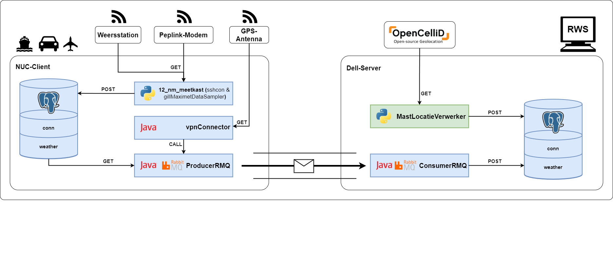

<!-- Improved compatibility of back to top link: See: https://github.com/othneildrew/Best-README-Template/pull/73 -->
<a id="readme-top"></a>
<!--
*** Thanks for checking out the Best-README-Template. If you have a suggestion
*** that would make this better, please fork the repo and create a pull request
*** or simply open an issue with the tag "enhancement".
*** Don't forget to give the project a star!
*** Thanks again! Now go create something AMAZING! :D
-->


<!-- PROJECT SHIELDS -->
<!--
*** I'm using markdown "reference style" links for readability.
*** Reference links are enclosed in brackets [ ] instead of parentheses ( ).
*** See the bottom of this document for the declaration of the reference variables
*** for contributors-url, forks-url, etc. This is an optional, concise syntax you may use.
*** https://www.markdownguide.org/basic-syntax/#reference-style-links
-->
<!-- [![Contributors][contributors-shield]][contributors-url]
[![Forks][forks-shield]][forks-url]
[![Stargazers][stars-shield]][stars-url]
[![Issues][issues-shield]][issues-url]
[![Unlicense License][license-shield]][license-url] -->


<!-- PROJECT LOGO -->
<br />
<div align="center">
  <a href="https://github.com/RWS-CFNS/MastLocatieVerwerker">
    
  </a>

  <h3 align="center">MastLocatieVerwerker</h3>

  <p align="center">
    Retrieves the location of the connected towers from OpenCellID
    <br />
    <a href="https://github.com/RWS-CFNS/MastLocatieVerwerker"><strong>Explore the docs »</strong></a>
    <br />
    <br />
    <a href="https://github.com/RWS-CFNS/MastLocatieVerwerker">View Demo</a>
    &middot;
    <a href="https://github.com/RWS-CFNS/MastLocatieVerwerker/issues/new?labels=bug&template=bug-report---.md">Report Bug</a>
    &middot;
    <a href="https://github.com/RWS-CFNS/MastLocatieVerwerker/issues/new?labels=enhancement&template=feature-request---.md">Request Feature</a>
  </p>
</div>


<!-- TABLE OF CONTENTS -->
<details>
  <summary>Table of Contents</summary>
  <ol>
    <li>
      <a href="#about-the-project">About The Project</a>
      <ul>
        <li><a href="#built-with">Built With</a></li>
      </ul>
    </li>
    <li>
      <a href="#getting-started">Getting Started</a>
      <ul>
        <li><a href="#prerequisites">Prerequisites</a></li>
        <li><a href="#installation">Installation</a></li>
      </ul>
    </li>
    <li><a href="#usage">Usage</a></li>
    <!-- <li><a href="#roadmap">Roadmap</a></li> -->
    <!-- <li><a href="#contributing">Contributing</a></li> -->
    <li><a href="#license">License</a></li>
    <!-- <li><a href="#contact">Contact</a></li> -->
    <!-- <li><a href="#acknowledgments">Acknowledgments</a></li> -->
  </ol>
</details>


<!-- ABOUT THE PROJECT -->
## System Architecture Overview


This application automates the process of retrieving and updating cell tower locations using the OpenCellID API and a PostgreSQL database. It scans the database for records with missing latitude and longitude values, extracts the necessary network identifiers (MCC, MNC, LAC/TAC, and Cell ID), and queries OpenCellID for their precise geolocation. Once retrieved, the coordinates are stored back in the database, ensuring accurate mapping of network infrastructure.
Key Features:

* Database Connectivity: Seamlessly connects to a PostgreSQL database to identify and update missing cell tower locations.
* API Integration: Uses the OpenCellID API to fetch precise geolocation data based on network identifiers.
* Automated Data Processing: Ensures accuracy by verifying API responses before updating records, improving the quality of network analysis.

This app is particularly useful for telecom companies, network analysts, and researchers looking to enhance cellular coverage data and infrastructure mapping.

Use the `BLANK_README.md` to get started.

<p align="right">(<a href="#readme-top">back to top</a>)</p>


### Built With

This section should list any major frameworks/libraries used to bootstrap your project. Leave any add-ons/plugins for the acknowledgements section. Here are a few examples.

[![Eclipse][Eclipse.org]][Eclipse-url]
[![Maven][Maven.org]][Maven-url]
[![Python][Python.org]][Python-url]
[![OpencellID][OpencellID.org]][OpencellID-url]

<p align="right">(<a href="#readme-top">back to top</a>)</p>


## Getting Started

### Prerequisites

Ensure you have Python 3 installed on your system.

### Installation

1. Download the latest release from the [Releases Page](https://github.com/RWS-CFNS/MastLocatieVerwerker/releases) and extract the ZIP file.
2. Configure database and API parameters by updating the script with your credentials:
   ```python
   db_host = "your_postgres_host"
   db_name = "your_database_name"
   db_user = "your_database_user"
   db_password = "your_database_password"
   db_port = "5432"
   api_key = "your_opencellid_api_key"
   ```
3. Run the script manually to test:
   ```sh
   python3 script.py
   ```

## Usage

The script queries a PostgreSQL database for missing latitude and longitude values, retrieves data from the OpenCellID API, and updates the database accordingly.

For best results, schedule the script to run automatically using a cron job.

*For more details, refer to the API documentation at **[OpenCellID](https://opencellid.org)*


<!-- ROADMAP 
## Roadmap

- [x] Add Changelog
- [x] Add back to top links
- [ ] Add Additional Templates w/ Examples
- [ ] Add "components" document to easily copy & paste sections of the readme
- [ ] Multi-language Support
    - [ ] Chinese
    - [ ] Spanish

See the [open issues](https://github.com/RWS-CFNS/MastLocatieVerwerker/issues) for a full list of proposed features (and known issues).

<p align="right">(<a href="#readme-top">back to top</a>)</p> -->


<!-- CONTRIBUTING 
## Contributing

Contributions are what make the open source community such an amazing place to learn, inspire, and create. Any contributions you make are **greatly appreciated**.

If you have a suggestion that would make this better, please fork the repo and create a pull request. You can also simply open an issue with the tag "enhancement".
Don't forget to give the project a star! Thanks again!

1. Fork the Project
2. Create your Feature Branch (`git checkout -b feature/AmazingFeature`)
3. Commit your Changes (`git commit -m 'Add some AmazingFeature'`)
4. Push to the Branch (`git push origin feature/AmazingFeature`)
5. Open a Pull Request

### Top contributors:

<a href="https://github.com/RWS-CFNS/MastLocatieVerwerker/graphs/contributors">
  
</a>

<p align="right">(<a href="#readme-top">back to top</a>)</p> -->


<!-- LICENSE -->
## License

Distributed under the Unlicense License. See `LICENSE.txt` for more information.

<p align="right">(<a href="#readme-top">back to top</a>)</p>


<!-- CONTACT -->
<!-- ## Contact

Your Name - [@your_twitter](https://twitter.com/your_username) - email@example.com

Project Link: [https://github.com/your_username/repo_name](https://github.com/your_username/repo_name)

<p align="right">(<a href="#readme-top">back to top</a>)</p> -->


<!-- ACKNOWLEDGMENTS 
## Acknowledgments

Use this space to list resources you find helpful and would like to give credit to. I've included a few of my favorites to kick things off!

* [Choose an Open Source License](https://choosealicense.com)
* [GitHub Emoji Cheat Sheet](https://www.webpagefx.com/tools/emoji-cheat-sheet)
* [Malven's Flexbox Cheatsheet](https://flexbox.malven.co/)
* [Malven's Grid Cheatsheet](https://grid.malven.co/)
* [Img Shields](https://shields.io)
* [GitHub Pages](https://pages.github.com)
* [Font Awesome](https://fontawesome.com)
* [React Icons](https://react-icons.github.io/react-icons/search)

<p align="right">(<a href="#readme-top">back to top</a>)</p> -->


<!-- MARKDOWN LINKS & IMAGES -->
<!-- https://www.markdownguide.org/basic-syntax/#reference-style-links -->
[contributors-shield]: https://img.shields.io/github/contributors/RWS-CFNS/MastLocatieVerwerker.svg?style=for-the-badge
[contributors-url]: https://github.com/RWS-CFNS/MastLocatieVerwerker/graphs/contributors
[forks-shield]: https://img.shields.io/github/forks/RWS-CFNS/MastLocatieVerwerker.svg?style=for-the-badge
[forks-url]: https://github.com/RWS-CFNS/MastLocatieVerwerker/network/members
[stars-shield]: https://img.shields.io/github/stars/RWS-CFNS/MastLocatieVerwerker.svg?style=for-the-badge
[stars-url]: https://github.com/RWS-CFNS/MastLocatieVerwerker/stargazers
[issues-shield]: https://img.shields.io/github/issues/RWS-CFNS/MastLocatieVerwerker.svg?style=for-the-badge
[issues-url]: https://github.com/RWS-CFNS/MastLocatieVerwerker/issues
[license-shield]: https://img.shields.io/github/license/RWS-CFNS/MastLocatieVerwerker.svg?style=for-the-badge
[license-url]: https://github.com/RWS-CFNS/MastLocatieVerwerker/blob/master/LICENSE.txt

[Eclipse.org]: https://img.shields.io/badge/Eclipse-7E48BD?style=for-the-badge&logo=eclipse&logoColor=white
[Eclipse-url]: https://Eclipse.org/
[Python.org]: https://img.shields.io/badge/Python-1985A1?style=for-the-badge&logo=python&logoColor=white
[Python-url]: https://python.org/
[Opencellid.org]: https://img.shields.io/badge/Opencellid-F09728?style=for-the-badge
[Opencellid-url]: https://Opencellid.org/
[Maven.org]: https://img.shields.io/badge/Maven-6A005C?style=for-the-badge&logo=apachemaven&logoColor=white
[Maven-url]: https://maven.apache.org/
